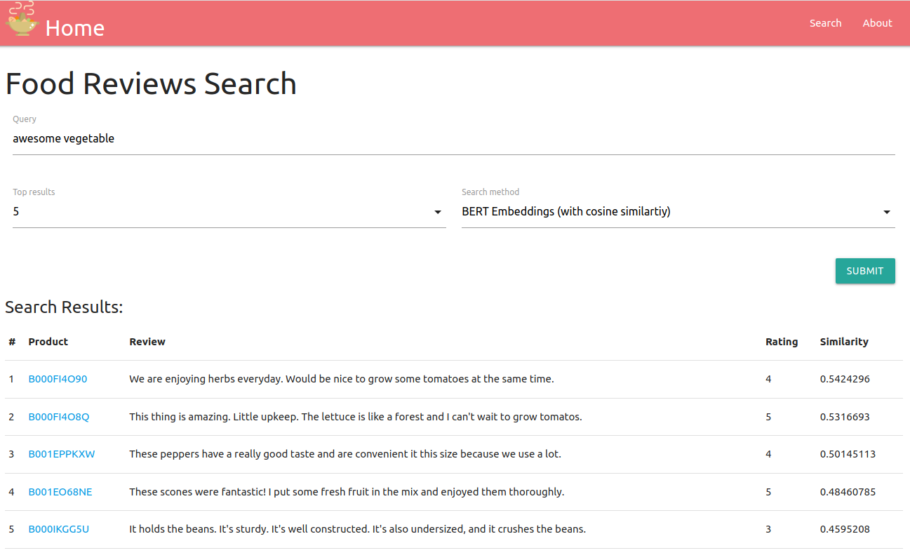

# Solr-SBERT-semantic-search
This is a simple web demo of semantic search (search by meaning) on food products using Solr and BERT embeddings.

## Introduction
In information retrieval, retrieved documents are ranked by relevance to the query.
Fundamentally, relevance is based on the textual similarity (e.g. BM25) between an information requirement (query) and an article (document).
However, a search system needs to measure the relevance of a document and a query beyond the simple textual similarity.
Specifically, textual similarity at the word level does not take into consideration the actual meaning of words or the entire phrase in context.
As such, we shall model the semantic similarity between two pieces of text to achieve a better search result.
The traditional approach to address semantic search is to transform each sentence into a vector space such that
semantically similar sentences will be close to each other. We use Sentence-BERT (SBERT)
to derive semantically meaningful BERT embeddings that can be compared using cosine similarity.
As a result, we are able to retrieve food products with reviews that have a similar meaning to our query. 
For example, for the "*astonishing food*" query, the system will return products with similar reviews like "*amazing food*" and "*delicious food*," 
which may not be retrieved if only textual similarity is used.

**Web Demo: https://semantic-embeddings.herokuapp.com/**

<p align="center">
  
</p>

## Technology Stack
Several technologies used in this project include:
* [Python 3.7/3.8](https://www.python.org/)
* [Django](https://www.djangoproject.com/)
* [Solr 6.6](https://solr.apache.org/guide/6_6/) 
* [SBERT](https://github.com/UKPLab/sentence-transformers)
* [Docker](https://www.docker.com/)
* [Heroku](https://www.heroku.com/)

## How to run?

### Run on local environment

1. Install `Java 8`

2. Install dependencies
```
$ pip install -r requirements.txt
```

3. Host the web locally
```
$ python manage.py runserver
```

**Note**: To run on Windows machine, the following steps may be required to run Solr server in background

* Replace `subprocess.Popen(['./solr-6.6.6/bin/solr', 'start'])` with `subprocess.Popen(['.\\solr-6.6.6\\bin\\solr', 'start'], shell=True)`

* Replace `subprocess.Popen(['./solr-6.6.6/bin/solr', 'stop', '-all'])` with `subprocess.Popen(['.\\solr-6.6.6\\bin\\solr', 'stop', '-all'], shell=True)`

### Run with Docker

1. Install `docker` and `docker-compose`

2. Start application
```
$ docker-compose up
```

## Miscellaneous
### 1. Data indexing in Solr
* We use a small part of Amazon Fine Food Reviews dataset in this application for semantic search, the full dataset can be found [here](https://www.kaggle.com/snap/amazon-fine-food-reviews)
* Our data are available at `search/setup_solr/amazon_food_reviews.csv`
* To re-index the data in Solr, make sure Solr is started and run the following command
```
$ python search/setup_solr/add_BERT_embedding_to_Solr.py
```

### 2. Pre-trained model used in SBERT
* SBERT provides different models for our usage. More details can be found [here](https://www.sbert.net/docs/pretrained_models.html).
* Because the application is deployed on a free dyno from Heroku, we choose and download a lightweight model locally to improve the web performance. 
The [**paraphrase-MiniLM-L3-v2**](search/setup_solr/paraphrase-MiniLM-L3-v2/) model offers a great trade-off between performance and speed. 

### 3. Deployment
* Containerize application with Docker
* Deploy Docker-based app to Heroku: [https://devcenter.heroku.com/articles/container-registry-and-runtime](https://devcenter.heroku.com/articles/container-registry-and-runtime)

### 4. Solr setup
To setup `solr` from scratch, follow the below steps:

* Download [`solr-6.6.6`](https://archive.apache.org/dist/lucene/solr/6.6.6/), unzip 
and put the folder in the project directory

* Start solr and create the core `bert`
```
$ cd solr-6.6.6
$ ./bin/solr start                                    # start solr
$ ./bin/solr create -c bert -n basic_config           # create core named 'bert'
$ ./bin/solr stop -all                                # stop solr
```

* As solr does not explicitly support cosine vector scoring, we need to install 
the external plugin [`solr-vector-scoring`](https://github.com/saaay71/solr-vector-scoring):

i. Copy [`VectorPlugin.jar`](https://github.com/saaay71/solr-vector-scoring/blob/master/VectorPlugin.jar)
to `solr/dist/plugins/` (Create the `plugins` folder if not exist)

ii. Add the library and plugin Query parser to `solr/server/solr/bert/conf/solrconfig.xml` 
file between the `<config>` and `</config>` tags
```
<lib dir="${solr.install.dir:../../../..}/dist/plugins/" regex=".*\.jar" />

<queryParser name="vp" class="com.github.saaay71.solr.VectorQParserPlugin" />
```

iii. Add the field `vector` and field type `VectorField` to 
`solr/server/solr/bert/conf/managed-schema` between the `<schema>` and `</schema>` tags
```
  <fieldType name="VectorField" class="solr.TextField" indexed="true" termOffsets="true" stored="true" termPayloads="true" termPositions="true" termVectors="true" storeOffsetsWithPositions="true">
    <analyzer>
      <tokenizer class="solr.WhitespaceTokenizerFactory"/>
      <filter class="solr.DelimitedPayloadTokenFilterFactory" encoder="float"/>
    </analyzer>
  </fieldType>

  <field name="vector" type="VectorField" indexed="true" termOffsets="true" stored="true" termPositions="true" termVectors="true" multiValued="true"/>
```

* Define the field `text` (for BM25 text search) in `solr/server/solr/bert/conf/solrconfig.xml`
```
<field name="text" type="text_general" indexed="true" stored="true" multiValued="true"/>
```

* Restart solr
```
./bin/solr start    
```

* Index data to solr
```
$ python search/setup_solr/add_BERT_embedding_to_Solr.py
```
